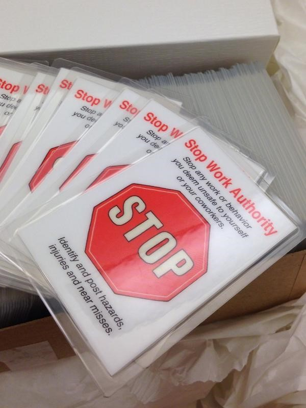

## Thanks

This post is a special thank you to <a href="https://twitter.com/JoshuaKerievsky">@JoshuaKerievsky</a>. First I do not work with Joshua, or am I associated with him, however he has inspired a large amount of good things within my team.

## Safety is a Skill

Bringing safety to the place I work is one of my highest priorities. Now to be fair, my place to work is the most safe place to work I can imagine. So why do I focus on bringing safety to my work?

**Safety is a skill.** It is why all manufacturing companies have mandatory safety training. But these trainings only cover one type of safety.

## Psychological Safety

Google discovered that <a href="http://www.nytimes.com/2016/02/28/magazine/what-google-learned-from-its-quest-to-build-the-perfect-team.html?_r=0">psychological safety</a> is the key to a well functioning team. We have seen similar successes in our team well before this article was written.

## Core Rules

My team's core rules have been in place for almost 4 years (as of September 2016). They focus on building psychological safety. They are:

1. Treat everyone with Kindness
1. Treat everyone with Consideration
1. Treat everyone with Respect

The first thing to notice is the word everyone. This is not just those you work with. It is not just the people within your department, company or developer community. It says everyone, and it means everyone. It also means that everyone you work with will do the same.

## The Cards

I won a raffle held by <a href="https://www.industriallogic.com/">Industrial Logic</a>, Joshua's company. The prize came with a small number of these cards:

The back states you have the autority to stop work if any of these things are at risk:

1. Time
1. Information
1. Reputation
1. Money
1. Health
1. Relationships

I instantly fell in love. I gave each member of my deportment one of the cards. I made discussing the cards part of the on boarding process. At the end of which I gave the new hire the card.

## On Boarding with Safety

I inform every employee that they have great authority when they come to work here. They can stop work if they feel the any action another is taking threatens any of those things. I then express how our practices, [Test Driven Development](https://en.wikipedia.org/wiki/Test-driven_development), [Continuos Integration](https://en.wikipedia.org/wiki/Continuous_integration), [Mob Programming](https://en.wikipedia.org/wiki/Mob_programming), and others help to protect these things.

The new hire now has the authority to stop our work if anyone violates these practices and the reason isn't to experiment on a better way; and even if that is the reason.

Then I tell them the hard part of this authority. They do not only have the authority, but the responsibility. It is part of the job requirement that they do this. Ignoring these hazards is willfully not doing your job.

One of the best moments of my career was when I told this to our interns. They could not believe any company would give them such responsibility and power.

## Part of our culture

A number of us have attached the card to our badges, as a reminder of how important this really is. We retrospect often and try to do things that promote this safety. I think we are better then any company I have ever heard of it this regard. However, I do not believe we are perfect or finished. The company recognizes that this safety has obviously contributed to our success and we are dedicated to finding better ways to achieve it or grow it.

