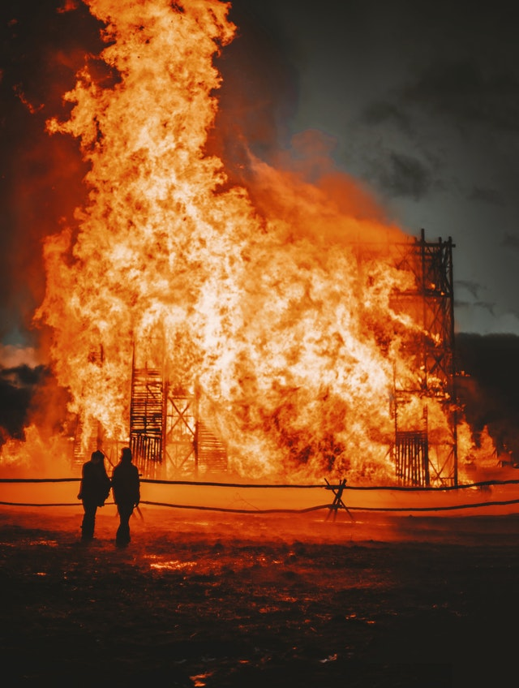



    

    
Photo by Anna Kester from Pexels

## TL; DR

Environment is a precondition of a successful retrospective, and the number one reason why it fails. Beyond that, the reasons come down to people not knowing how to get the most of their retrospective and they can improve as they gain knowledge.

## Who is this Post for

The only people capable of diagnosing a retrospective are those who are actively participating in the retro. Not even the Scrum Master or Coach. If you are not actively participating in the retro and try to diagnose the retro, you are most likely [inflicting help](https://www.estherderby.com/inflicting-help/).

This post is very much for people who are participating in regular retrospectives and not seeing the rewards that are promised.

## Environment First

Before we look at internal causes for a retrospective to fail, lets look externally. [Deming](https://deming.org/a-bad-system-will-beat-a-good-person-every-time/) says that a bad system trumps a good employee every time. This means that the environment is the number one cause for an individual or team's performance.

- What or who in the environment is preventing you from examining how you work?
- What or who in the environment is preventing you from changing the way you work?
- What or who in the environment is preventing you from working as a team?
- What or who in the environment is preventing you from trusting each other?

The environmental factors are a precondition to having a successful retrospective. If you can answer, not necessarily share, any of the above questions, then you cannot have a successful retrospective.

## Internal Problems

You cannot diagnose a problem caused by someone else, you can only diagnose problems you contribute to.

### Recently Became Boring

So if your retrospectives used to yield results and now don't, red this post: [What to do when retrospectives become stale]({{ related.url }}).

This is most often caused by not looking at the small things that get in the way.

### Bad Behavior

My friend an colleague Willem Larson identified some [retrospective smells](https://github.com/willemlarsen/retrospective-smells). These are a useful tool for analyzing your own behavior. Look through them, and determine which behavior you are exibiting, and then ask your self why? My ques is that these behaviors are directly caused by your environment.

### Bad Actor

A bad actor, is an environment issue. If the person is honestly a bad actor why are they still employed? Why are they a bad actor? Very few people are actually intentionally bad actors, and if you have someone who is a bad actor during retrospectives, it is likely they are bad actors in other ways also.

### Team Change.

This is also an environment issue, but one that is often overlooked. Every time team membership changes, a lot of unspoken things change. Unspoken roles on the team change, the very way the team communicates change. Things get overlooked, and new boundaries must be found. Any one of these things can cause a retrospective to fail. So don't forget that it takes a while to learn how to be a team again after a person leaves or joins a team.

### Despite Best Effort, Never Succeeded

This one is both the most straight forward and the most difficult to solve. You see, retrospecting is a skill. Every skill takes time, effort and guidance to learn. What makes it worse, is that _many_ agile frameworks think if you sprinkle some knowledge, like fairy dust, then anyone can facilitate a retrospective successfully.

The desire to improve will do a lot, but sometimes you may need help to get started. There are two things that will help. The first is find someone with the expertise, to guide you. when looking ask questions about what makes a good facilitator? Ignore everything said about retrospective activities, they are tools not solutions. Instead look to how they think about problem solving and how they can teach you to see problems that you don't recognize.

The second, is start studying about human systems and learning. The combination of these things will garner insight and help you find your first success.

----

<aside class="series">
  <h4>This post is part of the series <em>{{ site.data.series | where: 'id', page.series | map: 'title' }}</em></h4>
  <ol>
    
    
    <li>
      
      <strong>{{ post.title }}</strong>
      
      <a href="{{ site.baseurl }}{{ post.url }}">{{ post.title }}</a>
      
    </li>
    
  </ol>
  
  
More posts coming soon!

  
</aside>